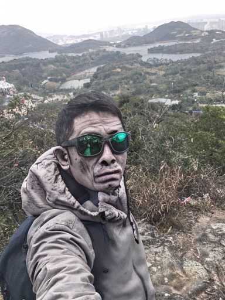

<h1 align="center">
    
</h1>

<h3 align="center">记录个人在大湾区徒步的线路 
    A personal log of hiking, camping, and car camping trips in the Greater Bay Area of China.</h3>

 

   
## 港岛一日游：历史与自然的碰撞

### 行程安排

#### 上午：中环历史文化之旅
* **中环荷里活道:** 漫步于这条充满怀旧气息的街道，两旁的古董店、画廊和茶楼让你仿佛穿越时空。
* **文武庙:** 参观这座历史悠久的庙宇，感受香港的传统文化。
* **石板街:** 体验维多利亚时代的香港，感受石板路下的历史故事。
* **半山扶梯:** 乘坐世界上最长的户外有盖扶梯，欣赏维多利亚港的壮丽景色。

#### 中午：中环美食
* **兰芳园:** 品尝地道的港式丝袜奶茶和菠萝油。
* **镛记酒家:** 享用正宗的粤菜。

#### 下午：山顶风光
* **山顶缆车:** 搭乘百年历史的山顶缆车，欣赏维多利亚港的壮丽景色。
* **卢吉道:** 在这条林荫小道上漫步，感受大自然的清新空气。
* **凌霄阁:** 登上凌霄阁，俯瞰整个香港岛。
* **西高山:** 如果时间充裕，可以前往西高山，欣赏更广阔的城市景观。

### 交通建议
* **地铁:** 中环站是整个行程的交通枢纽。
* **山顶缆车:** 从中环花园道山顶缆车总站出发。
* **巴士:** 多条巴士线路可到达山顶和西高山。

### 行程亮点
* **历史与现代的交汇:** 中环的古老建筑和现代化的高楼大厦形成鲜明对比。
* **自然与城市的融合:** 山顶的绿意盎然与都市的繁华交相辉映。
* **美食体验:** 品尝地道的港式美食。
* **无敌海景:** 从山顶俯瞰维多利亚港的壮丽景色。

### 行程注意事项
* **穿着舒适的鞋子:** 因为会涉及到较多的步行。
* **携带防晒霜和帽子:** 山顶阳光充足。
* **注意交通安全:** 过马路时要小心。
* **提前规划路线:** 可以使用Google地图或其他导航软件。

**观看youtube视频需要开启VPN**

<!-- BEGIN YOUTUBE-CARDS -->

<!-- END YOUTUBE-CARDS -->

### Hi there 👋, i am shark
#### 喜欢Hiking Camping 

### 深圳户外爱好者

我是生活在深圳的户外运动爱好者。周末的时光，更愿意背上背包，走进山林，感受大自然的清新空气。从梧桐山到七娘山，深圳周边的小山小水都留下了我的足迹。

除了徒步，我还喜欢自驾游，在周末或假期里，开着我的爱车，和朋友们一起到附近的营地露营。围坐在一起，欣赏自然美景，喝喝咖啡 品品茶，听虫鸣鸟叫，是一件休闲惬意的事情。

Skills: Hiking Camping 

### 👓My Youtube Chanel

- 🔭 I’m currently working on this page. 

  

### Hi Welcome! 👋, I'shark
#### I am GitHub Readme Generator's creator

I made this project just for fun, it allows you to create nice and simple GitHub Readme files that you can copy/paste and use in your profile.

Skills: Markdown/Hiking/Camping/Car

- 🔭 I’m currently working on sharkchow.github.io 
- 📫 How to reach me: shark2hk@gmail.com 

      

 

  

